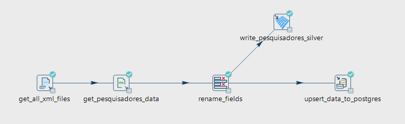
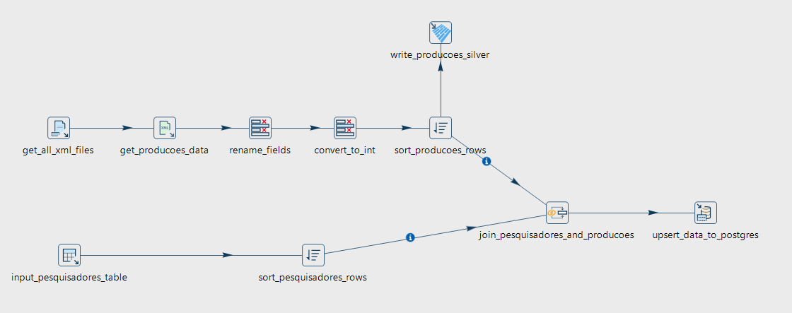
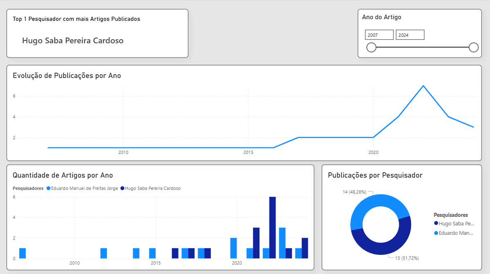

# Lattes ETL - Apache HOP

Pipeline de dados para extração, transformação e carga (ETL) de Currículos Lattes utilizando Apache HOP e PostgreSQL via Docker.

## Estrutura do Projeto

```
lattes-etl-hop/
├── busca-semantica-fts/
│   ├── fts_lattes.sql      # Scripts SQL para busca semântica
├── data/
│   ├── bronze/             # Arquivos XML brutos do Lattes
│   └── silver/             # Dados processados (Parquet)
├── utils/
│   ├── query_sql/          # Scripts SQL
│   └── Treinamento_HOP_Final.pdf
├── hop/                    # Pipelines e workflows do Apache HOP
├── power_bi/               # Dashboard Power BI
├── dockerfile              # Imagem Docker do PostgreSQL
└── init_db.sh              # Script de inicialização do banco de dados
```

## Pré-requisitos

- [Docker Desktop](https://www.docker.com/products/docker-desktop/)
- [Apache HOP](https://hop.apache.org/)
- [pgAdmin 4](https://www.pgadmin.org/)
- [Power BI Desktop](https://powerbi.microsoft.com/)

## Configuração do Banco de Dados

### 1. Build e start do container

```bash
docker build -t docker_simcc .
docker run -d --name docker_simcc -p 5437:5432 docker_simcc
```

### 2. Conexão no pgAdmin 4

| Campo    | Valor          |
|----------|----------------|
| Host     | 127.0.0.1      |
| Porta    | 5437           |
| Usuário  | postgres       |
| Banco    | BD_PESQUISADOR |

### 3. Criação das tabelas

No pgAdmin 4, abra o **Query Tool** no banco `BD_PESQUISADOR` e execute:

```sql
CREATE EXTENSION "uuid-ossp";

CREATE TABLE IF NOT EXISTS pesquisadores (
  pesquisadores_id UUID NOT NULL DEFAULT uuid_generate_v4(),
  lattes_id VARCHAR(16) NOT NULL,
  nome VARCHAR(200) NOT NULL,
  PRIMARY KEY (pesquisadores_id)
);

CREATE TABLE IF NOT EXISTS producoes (
  producoes_id UUID NOT NULL DEFAULT uuid_generate_v4(),
  pesquisadores_id UUID NOT NULL,
  issn VARCHAR(16) NOT NULL,
  titulo_artigo TEXT NOT NULL,
  ano_artigo INTEGER NOT NULL,
  PRIMARY KEY (producoes_id),
  CONSTRAINT fkey FOREIGN KEY (pesquisadores_id)
    REFERENCES pesquisadores (pesquisadores_id)
    ON UPDATE NO ACTION ON DELETE NO ACTION
);
```

## Pipelines Apache HOP

| Pipeline | Descrição |
|----------|-----------|
| `pesquisador.hpl`    | Extrai dados de um único XML do Lattes |
| `pesquisadores.hpl`  | Extrai dados de múltiplos XMLs |
| `producoes.hpl`      | Extrai artigos indexados e carrega na tabela `producoes` |

### Pesquisadores


### Producoes


### Configuração da conexão no HOP

- **Connection type**: PostgreSQL
- **Host**: 127.0.0.1
- **Port**: 5437
- **Database**: BD_PESQUISADOR
- **Username**: postgres

## Resultado

Dashboard interativo no Power BI conectado diretamente ao PostgreSQL, com filtro de ano (2007–2024) e os seguintes visuais:

- **Top 1 Pesquisador com mais Artigos Publicados** — card com destaque para o pesquisador líder
- **Evolução de Publicações por Ano** — gráfico de linha com tendência histórica
- **Quantidade de Artigos por Ano** — gráfico de barras clusterizado por pesquisador
- **Publicações por Pesquisador** — gráfico de rosca com percentual por pesquisador

Pesquisadores analisados: **Hugo Saba Pereira Cardoso** (51,72%) e **Eduardo Manuel de Freitas Jorge** (48,28%).



## Busca Semântica Textual (Full Text Search)

O script `busca-semantica-lattes/fts_lattes.sql` implementa busca textual completa sobre as tabelas `pesquisadores` e `producoes` usando os recursos nativos de Full Text Search do PostgreSQL.

Baseado no tutorial [PostgreSQL Full Text Search](https://www.infoq.com/br/articles/postgresql-fts/), o script cobre:

| Seção | Recurso |
|-------|---------|
| 1 | Construção de documentos com `to_tsvector()` |
| 2 | Consultas com `to_tsquery()` e operadores `&`, `\|`, `!`, `:*` |
| 3 | Suporte a idiomas (`english`, `portuguese`, `simple`) |
| 4 | Acentuação com extensão `unaccent` e configuração personalizada `pt` |
| 5 | Ranking de relevância com `setweight()` e `ts_rank()` |
| 6 | Indexação com `GIN`, `MATERIALIZED VIEW` e `REFRESH` |
| 7 | Correção ortográfica com extensão `pg_trgm` e função `similarity()` |

Como o corpus tem títulos em **inglês e português misturados**, a configuração `'simple'` é usada como padrão — sem stemming, compatível com qualquer idioma.

### Exemplos de busca

```sql
-- Buscar produções que contenham "dengue" E "fever"
SELECT producoes_id, titulo_artigo, nome_pesquisador
FROM mv_indice_busca
WHERE documento @@ to_tsquery('simple', 'dengue & fever')
ORDER BY ts_rank(documento, to_tsquery('simple', 'dengue & fever')) DESC;

-- Busca tolerante a erros ortográficos: 'dngue' → 'dengue'
WITH termo_corrigido AS (
    SELECT word AS termo
    FROM mv_lexemas_unicos
    WHERE similarity(word, 'dngue') > 0.3
    ORDER BY word <-> 'dngue'
    LIMIT 1
)
SELECT mv.titulo_artigo, mv.nome_pesquisador
FROM mv_indice_busca mv, termo_corrigido tc
WHERE mv.documento @@ to_tsquery('simple', tc.termo);
``` 